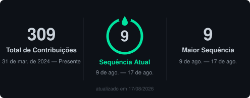
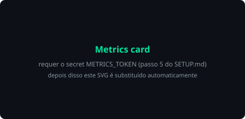

 

---

### 👇 Este perfil é interativo — clique nas setinhas para abrir cada seção

<b>🇧🇷 Sobre mim (Português)</b>

 

Olá! Sou o **Gustavo**, estudante de Engenharia de Software na **PUC-PR** (Curitiba/PR), com formatura prevista para **novembro de 2027** — e planos de emendar um mestrado logo depois.

Hoje trabalho como **dev freelancer** e busco um **estágio** para aprofundar C#, .NET e qualquer stack que aparecer no caminho. Em paralelo, estou construindo com um grupo de amigos um **SaaS de gestão de frotas** com controle financeiro integrado.

O próximo capítulo é **cibersegurança**: estou estudando fundamentos de redes, hardening e blue team para migrar de "dev que se preocupa com segurança" para "profissional de segurança que sabe programar".

> 🏆 *Fun fact:* trabalho melhor sob pressão — prazo apertado me deixa mais focado, não menos.

<b>🇺🇸 About me (English)</b>

 

Hi! I'm **Gustavo**, a Software Engineering student at **PUC-PR** in Curitiba, Brazil, graduating in **November 2027**, with a master's degree on the roadmap right after.

I currently work as a **freelance developer** and I'm looking for an **internship** to go deeper into C#, .NET and whatever stack comes my way. On the side, I'm building a **fleet-management SaaS** with integrated financial tracking together with a group of friends.

Next chapter: **cybersecurity**. I'm studying networking fundamentals, hardening and blue-team practices to move from "a dev who cares about security" to "a security professional who can code".

> 🏆 *Fun fact:* I thrive under pressure — a tight deadline makes me sharper, not slower.

<b>🧭 No que estou trabalhando agora / What I'm doing now</b>

 

| | |
|---|---|
| 🔭 **Construindo** | SaaS de gestão de frotas (.NET + Vertical Slice) |
| 🌱 **Estudando** | C# avançado, DDD, fundamentos de redes e segurança |
| 🎯 **Meta 2026** | Fechar um estágio e a primeira certificação de segurança |
| 💬 **Pergunte sobre** | C#, .NET, arquitetura, faculdade de Eng. de Software |
| ⚡ **Disponível para** | Estágio, freelance e projetos open source |

---

## 🛠️ Tech Stack

<b>📂 Ver stack detalhada por categoria</b>

 

**Linguagens**

**Backend & Dados**

**Cloud & Infra**

**Arquitetura & Práticas**

---

## 🔐 Road to Cybersecurity

<b>Meu roadmap público — atualizado conforme avanço</b>

 

**Fundamentos**

- [x] Redes: TCP/IP, DNS, HTTP/HTTPS
- [x] Linux básico e linha de comando
- [ ] Criptografia aplicada (hashing, TLS, PKI)
- [ ] Windows internals & Active Directory

**Prática**

- [ ] TryHackMe — trilha *Pre Security*
- [ ] TryHackMe — trilha *Cyber Security 101*
- [ ] Hack The Box — 10 máquinas easy
- [ ] Lab próprio: SIEM caseiro (Wazuh + ELK)

**Certificações (alvo)**

- [ ] CompTIA Security+
- [ ] Blue Team Level 1 (BTL1)

<!-- Quando criar suas contas, descomente os badges abaixo trocando o usuário:

-->

> 💡 Tem uma sugestão de trilha, curso ou lab? [Manda aqui](https://github.com/reeedfist/reeedfist/issues/new?template=sugestao.yml) — leio todas.

---

## 📌 Projetos em destaque

<b>🚚 Fleet SaaS — gestão de frotas com controle financeiro</b>

 

Plataforma que junta operação de frota e financeiro no mesmo lugar. Construída em .NET seguindo **Vertical Slice Architecture** e **DDD**, com foco em manter cada feature isolada e testável.

`.NET` `PostgreSQL` `Docker` `DDD` `Vertical Slice`

*Repositório privado por enquanto — posso apresentar o projeto em uma conversa.*

<b>💊 Reminder — lembrete de medicamentos</b>

 

Aplicação para não deixar passar horário de remédio. Um projeto pequeno, mas que resolve um problema real de gente próxima.

➜ [Ver repositório](https://github.com/reeedfist/Reminder)

<b>🏢 NavarroCapital — projeto de avaliação de estágio</b>

 

Site institucional desenvolvido como desafio técnico em processo seletivo de estágio.

➜ [Ver repositório](https://github.com/reeedfist/NavarroCapital)

<b>🎓 Estudos — C#, algoritmos e faculdade</b>

 

➜ [C--Studies](https://github.com/reeedfist/C--Studies) — anotações e exercícios de C#/.NET
➜ [Projeto-Final-Conectivos](https://github.com/reeedfist/Projeto-Final-Conectivos) — projeto final em Python

---

## 📊 GitHub Stats

<!-- Estes SVGs são gerados por GitHub Actions e commitados neste próprio repositório.
     Nada é buscado de servidor de terceiros na hora que alguém abre o perfil,
     então não quebram por rate limit como os cards antigos quebravam. -->

  

---

<!-- ══════════════════════════════════════════════════════════════════════════
     🐍 CONTRIBUTION SNAKE — seção desativada temporariamente

     O GitHub Actions está bloqueado nesta conta por uma pendência de cobrança
     ("your account is locked due to a billing issue"), então a branch `output`
     com os SVGs da cobrinha não é gerada e a imagem apareceria quebrada.

     PARA REATIVAR, depois de regularizar a cobrança:
       1. Actions > "🐍 Contribution snake" > Run workflow (espere ~1 min)
       2. apague esta linha de comentário e o "-->" lá embaixo

## 🐍 Contribution Snake

<picture>
  <source media="(prefers-color-scheme: dark)" srcset="https://raw.githubusercontent.com/reeedfist/reeedfist/output/github-contribution-grid-snake-dark.svg" />
  <source media="(prefers-color-scheme: light)" srcset="https://raw.githubusercontent.com/reeedfist/reeedfist/output/github-contribution-grid-snake.svg" />
  
</picture>

---
     ══════════════════════════════════════════════════════════════════════════ -->

## 💬 Interaja comigo

**Clique em um botão abaixo — abre uma issue já preenchida, é só escrever e enviar.**

 

### 📖 Mural de recados

> Os últimos recados aparecem aqui automaticamente. Deixe o seu no botão acima. 👆

<!-- GUESTBOOK:START -->
<!-- Nenhum recado ainda — seja o primeiro! -->
<!-- GUESTBOOK:END -->

---

Obrigado por passar aqui. Se algo neste perfil te foi útil, uma ⭐ em algum repositório já faz o dia. 🚀

 

---

### 👇 Este perfil é interativo — clique nas setinhas para abrir cada seção

<b>🇧🇷 Sobre mim (Português)</b>

 

Olá! Sou o **Gustavo**, estudante de Engenharia de Software na **PUC-PR** (Curitiba/PR), com formatura prevista para **novembro de 2027** — e planos de emendar um mestrado logo depois.

Hoje trabalho como **dev freelancer** e busco um **estágio** para aprofundar C#, .NET e qualquer stack que aparecer no caminho. Em paralelo, estou construindo com um grupo de amigos um **SaaS de gestão de frotas** com controle financeiro integrado.

O próximo capítulo é **cibersegurança**: estou estudando fundamentos de redes, hardening e blue team para migrar de "dev que se preocupa com segurança" para "profissional de segurança que sabe programar".

> 🏆 *Fun fact:* trabalho melhor sob pressão — prazo apertado me deixa mais focado, não menos.

<b>🇺🇸 About me (English)</b>

 

Hi! I'm **Gustavo**, a Software Engineering student at **PUC-PR** in Curitiba, Brazil, graduating in **November 2027**, with a master's degree on the roadmap right after.

I currently work as a **freelance developer** and I'm looking for an **internship** to go deeper into C#, .NET and whatever stack comes my way. On the side, I'm building a **fleet-management SaaS** with integrated financial tracking together with a group of friends.

Next chapter: **cybersecurity**. I'm studying networking fundamentals, hardening and blue-team practices to move from "a dev who cares about security" to "a security professional who can code".

> 🏆 *Fun fact:* I thrive under pressure — a tight deadline makes me sharper, not slower.

<b>🧭 No que estou trabalhando agora / What I'm doing now</b>

 

| | |
|---|---|
| 🔭 **Construindo** | SaaS de gestão de frotas (.NET + Vertical Slice) |
| 🌱 **Estudando** | C# avançado, DDD, fundamentos de redes e segurança |
| 🎯 **Meta 2026** | Fechar um estágio e a primeira certificação de segurança |
| 💬 **Pergunte sobre** | C#, .NET, arquitetura, faculdade de Eng. de Software |
| ⚡ **Disponível para** | Estágio, freelance e projetos open source |

---

## 🛠️ Tech Stack

<b>📂 Ver stack detalhada por categoria</b>

 

**Linguagens**

**Backend & Dados**

**Cloud & Infra**

**Arquitetura & Práticas**

---

## 🔐 Road to Cybersecurity

<b>Meu roadmap público — atualizado conforme avanço</b>

 

**Fundamentos**

- [x] Redes: TCP/IP, DNS, HTTP/HTTPS
- [x] Linux básico e linha de comando
- [ ] Criptografia aplicada (hashing, TLS, PKI)
- [ ] Windows internals & Active Directory

**Prática**

- [ ] TryHackMe — trilha *Pre Security*
- [ ] TryHackMe — trilha *Cyber Security 101*
- [ ] Hack The Box — 10 máquinas easy
- [ ] Lab próprio: SIEM caseiro (Wazuh + ELK)

**Certificações (alvo)**

- [ ] CompTIA Security+
- [ ] Blue Team Level 1 (BTL1)

<!-- Quando criar suas contas, descomente os badges abaixo trocando o usuário:

-->

> 💡 Tem uma sugestão de trilha, curso ou lab? [Manda aqui](https://github.com/reeedfist/reeedfist/issues/new?template=sugestao.yml) — leio todas.

---

## 📌 Projetos em destaque

<b>🚚 Fleet SaaS — gestão de frotas com controle financeiro</b>

 

Plataforma que junta operação de frota e financeiro no mesmo lugar. Construída em .NET seguindo **Vertical Slice Architecture** e **DDD**, com foco em manter cada feature isolada e testável.

`.NET` `PostgreSQL` `Docker` `DDD` `Vertical Slice`

*Repositório privado por enquanto — posso apresentar o projeto em uma conversa.*

<b>💊 Reminder — lembrete de medicamentos</b>

 

Aplicação para não deixar passar horário de remédio. Um projeto pequeno, mas que resolve um problema real de gente próxima.

➜ [Ver repositório](https://github.com/reeedfist/Reminder)

<b>🏢 NavarroCapital — projeto de avaliação de estágio</b>

 

Site institucional desenvolvido como desafio técnico em processo seletivo de estágio.

➜ [Ver repositório](https://github.com/reeedfist/NavarroCapital)

<b>🎓 Estudos — C#, algoritmos e faculdade</b>

 

➜ [C--Studies](https://github.com/reeedfist/C--Studies) — anotações e exercícios de C#/.NET
➜ [Projeto-Final-Conectivos](https://github.com/reeedfist/Projeto-Final-Conectivos) — projeto final em Python

---

## 📊 GitHub Stats

<!-- Estes SVGs são gerados por GitHub Actions e commitados neste próprio repositório.
     Nada é buscado de servidor de terceiros na hora que alguém abre o perfil,
     então não quebram por rate limit como os cards antigos quebravam. -->

  

---

## 🐍 Contribution Snake

<picture>
  <source media="(prefers-color-scheme: dark)" srcset="https://raw.githubusercontent.com/reeedfist/reeedfist/output/github-contribution-grid-snake-dark.svg" />
  <source media="(prefers-color-scheme: light)" srcset="https://raw.githubusercontent.com/reeedfist/reeedfist/output/github-contribution-grid-snake.svg" />
  
</picture>

---

## 💬 Interaja comigo

**Clique em um botão abaixo — abre uma issue já preenchida, é só escrever e enviar.**

 

### 📖 Mural de recados

> Os últimos recados aparecem aqui automaticamente. Deixe o seu no botão acima. 👆

<!-- GUESTBOOK:START -->
<!-- Nenhum recado ainda — seja o primeiro! -->
<!-- GUESTBOOK:END -->

---

Obrigado por passar aqui. Se algo neste perfil te foi útil, uma ⭐ em algum repositório já faz o dia. 🚀

